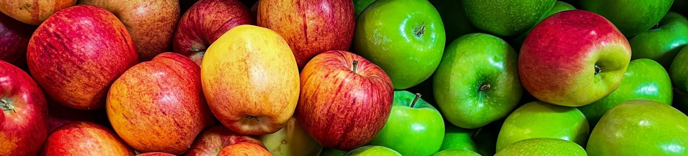

# 🍏🍎 Recette de Compote de Pommes Maison

## Ingrédients (pour environ 4 personnes)

- **6 pommes** (type Golden ou Granny Smith)
- **1/2 tasse** d'eau (environ 125 ml)
- **1 cuillère à soupe** de jus de citron
- **2 cuillères à soupe** de sucre (facultatif, selon les goûts)
- **1/2 cuillère à café** de cannelle (facultatif)

## Instructions

1. **Préparation des pommes** :
   - Éplucher les pommes, retirer le cœur et les couper en petits morceaux.
   - Mettre les morceaux de pommes dans une grande casserole.

2. **Cuisson** :
   - Ajouter l'eau et le jus de citron dans la casserole avec les pommes.
   - Porter à ébullition à feu moyen, puis réduire à feu doux.
   - Laisser mijoter pendant **15 à 20 minutes**, en remuant de temps en temps, jusqu'à ce que les pommes soient tendres.

3. **Mixer la compote** :
   - Une fois les pommes cuites, retirer du feu.
   - Utiliser un mixeur ou un presse-purée pour obtenir une compote lisse. Pour une compote avec des morceaux, écraser légèrement avec une cuillère en bois.
   - Ajouter le sucre et la cannelle selon vos goûts, puis mélanger.

4. **Dégustation** :
   - Servir la compote chaude ou froide, selon vos préférences.
   - **Astuce** : La compote se conserve au réfrigérateur pendant 3 à 4 jours.
   - 
---

## Temps de préparation et cuisson

| Étape             | Temps (minutes) |
| ----------------- | --------------- |
| Préparation       | 10              |
| Cuisson           | 15-20           |
| Finition          | 5               |

---

## Idées d'accompagnements

La compote de pommes se déguste parfaitement seule ou accompagnée de :

- Crêpes ([Recette des crêpes maison](index.md))
- Pain perdu
- Gaufres
- Yaourt nature
- Fromage blanc

---

## Conseils

- Variez les types de pommes pour ajuster le goût sucré ou acidulé de la compote.
- Ajoutez une pointe de vanille pour une saveur plus douce et aromatique.

---

Bon appétit et profitez de votre compote maison ! 🍏
